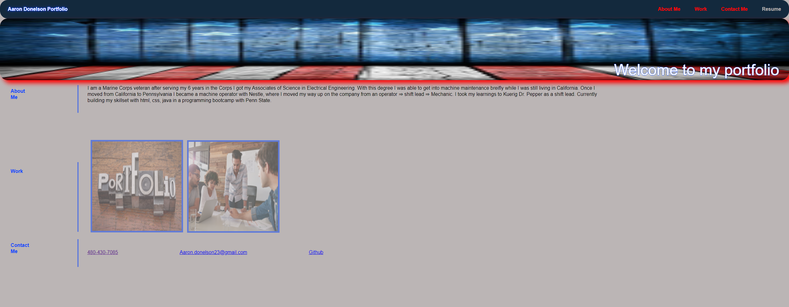

# <Portfolio>
## Description
Provide a short description explaining the what, why, and how of your project. Use the following questions as a guide:
- What was your motivation? I was motivated to make this project to help you understand my current skillset and capabilities with html, and css. 
- Why did you build this project? This project was designed to showcase my working skills.
- What problem does it solve? My page will help connect individuals to the my best projects. 
- What did you learn? When creating this project page I learned a significant amount about focusing on mobile first.  
## Installation
Attached is a link to the deployed page for easy access. https://addonelson.github.io/Portfolio/

Provide instructions and examples for use. Include screenshots as needed.
To add a screenshot, create an `assets/images` folder in your repository and upload your screenshot to it. Then, using the relative filepath, add it to your README using the following syntax:
    ```md
    
    ```
